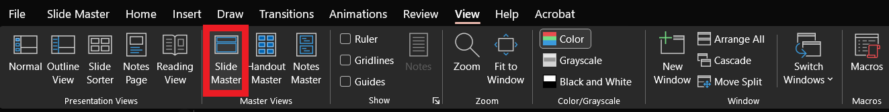
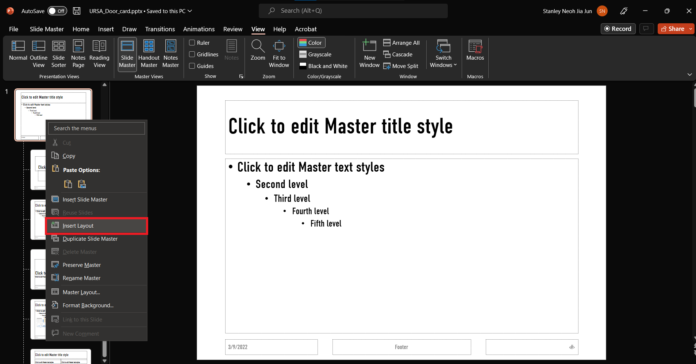
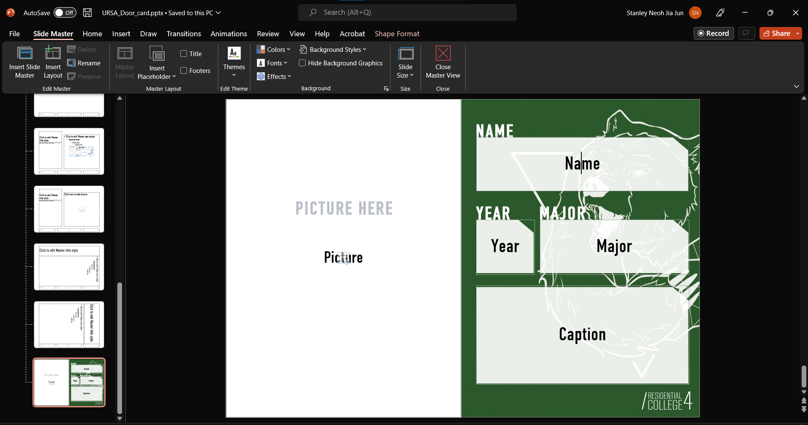
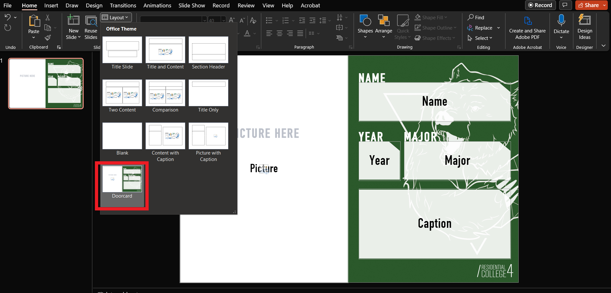
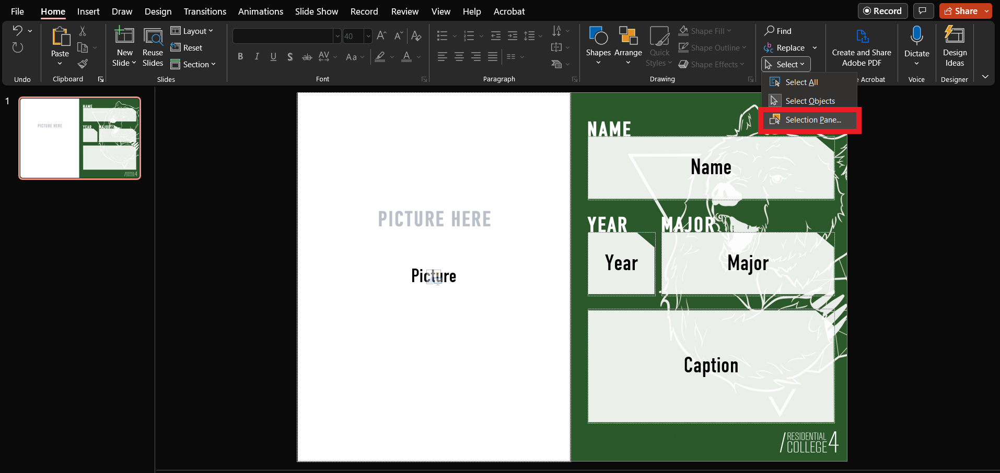
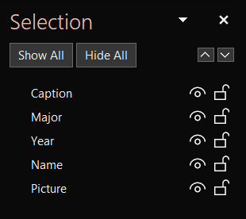

# RC4DoorcardGenerator

Generates Doorcards from a power point template.

## Default fields
- ***NameCol*** = 'Name'
  - Column of .xlsx file containing the UNIQUE names of residents
  - The generated files will utilse this name
- ***DisplayCol*** = 'Name (to be displayed on doorcard)'
  - Column of .xlsx file containing the names to be displayed
- ***YearCol*** = 'Year'
  - Column of .xlsx file containing the year of the residents
- ***MajorCol*** = 'Major'
  - Column of .xlsx file containing the major the resident is studying
- ***CaptionCol*** = 'Doorcard Caption'
  - Column of .xlsx file containing the caption to be displayed
- ***ExcelLocation*** = './doorcards.xlsx'
  - Relative path of .xlsx file containing the above data of users
- ***TemplateLocation*** = './templates/URSA_Door_card.pptx'
  - Relative path of the powerpoint template utilised
  - Refer to [template designing](#template-designing) for more information.
- ***FontLocation*** = './font/DINCondensed-Regular.ttf'
  - path of the .ttf font file
- ***PhotoLocation*** = './doorcard_photos'
  - path to folder containing the photos of residents
  - The name of the photo must contain the residents name as specified in ***NameCol***
- ***PptxDestination*** = './doorcards_pptx'
  - The folder to generate the pptx doorcard files in

## Installation and setup
1. clone repo and cd into folder
1. setup [virtual environment](https://docs.python.org/3/library/venv.html)
1. run `pip install -r requirements.txt`
1. Modify config.json accordingly
1. Run main.py

## Template Designing
1. Open a new powerpoint in the templates folder and open View > Slide Master

  

2. Create a new layout.

  

3. Design your doorcard template and exit slide master after you are done

  

4. Create a new slide with your newly made layout

  

5. Open selection pane to rename the textboxes

  

6. Rename the textboxes accordingly

  
  
7. Update the ***TemplateLocation*** in the process.ipynb file accordingly
